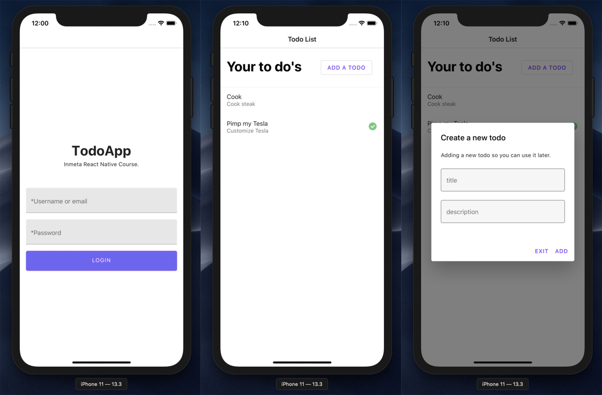

# React Native, Hooks, TypeScript

### To run the project

```sh
$ git clone https://github.com/webmasterdevlin/react-native-typescript.git
$ cd react-native-typescript
$ yarn install
$ yarn run backend
$ yarn run start:ios
```


